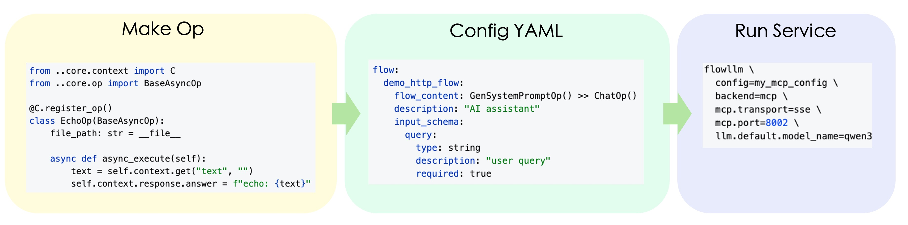

<p align="center">
  
</p>

<p align="center">
  <strong>FlowLLM: Making LLM-based HTTP/MCP Service Development Easier</strong><br>
  <em><sub>If you find it useful, please give us a ⭐ Star. Your support is the driving force for our continuous improvement</sub></em>
</p>

<p align="center">
  <a href="https://pypi.org/project/flowllm/"></a>
  <a href="https://pypi.org/project/flowllm/"></a>
  <a href="LICENSE"></a>
  <a href="https://github.com/flowllm-ai/flowllm"></a>
</p>

<p align="center">
  English | <a href="./README_ZH.md">简体中文</a>
</p>

---

## 📖 Introduction

FlowLLM encapsulates LLM/Embedding/vector store capabilities as HTTP/MCP services, suitable for AI conversational assistants, RAG applications, workflow services, and can be integrated into client tools that support MCP.

### 🏗️ Architecture Overview

<p align="center">
  
</p>


### ⭐ Core Features
- **Easy-to-use Op Development**: Inherit from BaseOp or BaseAsyncOp base classes and implement your business logic. FlowLLM provides lazy-initialized LLM, Embedding models, and vector stores. Developers can easily use these resources through `self.llm`, `self.embedding_model`, and `self.vector_store`. FlowLLM also provides complete Prompt template management capabilities through `prompt_format()` and `get_prompt()` methods for formatting and usage.

- **Flexible Flow Orchestration**: Combine Ops into Flows through YAML configuration files, supporting flexible orchestration. `>>` represents serial composition, `|` represents parallel composition. For example, `SearchOp() >> (AnalyzeOp() | TranslateOp()) >> FormatOp()` can build complex workflows. After defining input and output schemas, use the `flowllm config=your_config` command to start the service.

- **Automatic Service Generation**: After configuration, FlowLLM automatically generates HTTP, MCP, and CMD services. The HTTP service provides standard RESTful APIs, supporting synchronous JSON responses and HTTP Stream streaming responses. The MCP service automatically registers as Model Context Protocol tools and can be integrated into MCP-supported clients. The CMD service supports command-line mode to execute a single Op, suitable for quick testing and debugging.


### 🌟 Applications Based on FlowLLM

| Project Name | Description |
|--------------|-------------|
| [ReMe](https://github.com/agentscope-ai/ReMe) | Memory management toolkit for agents |

### 📚 Learning Resources

Here are learning resources shared by the project developers.

| Date       | Title                                                                                | Description                                          |
|------------|--------------------------------------------------------------------------------------|------------------------------------------------------|
| 2025-11-10 | [LangChain&Manus Video Materials](./docs/zh/reading/20251110-manus-context-raw.md)            | LangChain & Manus Context Management  Video |
| 2025-11-10 | [Context Management Guide](./docs/zh/reading/20251110-manus-context-report.md)                     | Evolution Guide from Prompt Engineering to Context Engineering                            |
| 2025-11-13 | [Gemini CLI Context Management Mechanism](./docs/zh/reading/20251113-gemini-cli-context-management.md) | Multi-layer Context Management Strategy for Gemini CLI                       |

---

## ⚡ Quick Start

### 📦 Step0 Installation

#### 📥 From PyPI

```bash
pip install flowllm
```

#### 🔧 From Source

```bash
git clone https://github.com/flowllm-ai/flowllm.git
cd flowllm
pip install -e .
```

For detailed installation and configuration methods, please refer to the [Installation Guide](docs/zh/guide/installation.md).

### ⚙️ Configuration

Create a `.env` file and configure your API Key. You can copy from `example.env` and modify:

```bash
cp example.env .env
```

Then configure your API Key in the `.env` file:

```bash
FLOW_LLM_API_KEY=sk-xxxx
FLOW_LLM_BASE_URL=https://xxxx/v1
FLOW_EMBEDDING_API_KEY=sk-xxxx
FLOW_EMBEDDING_BASE_URL=https://xxxx/v1
```

For detailed configuration instructions, please refer to the [Configuration Guide](docs/zh/guide/config_guide.md).

### 🛠️ Step1 Build Op

```python
from flowllm.core.context import C
from flowllm.core.op.base_async_op import BaseAsyncOp
from flowllm.core.schema import Message
from flowllm.core.enumeration import Role

@C.register_op()
class SimpleChatOp(BaseAsyncOp):
    async def async_execute(self):
        query = self.context.get("query", "")
        messages = [Message(role=Role.USER, content=query)]
        response = await self.llm.achat(messages=messages)
        self.context.response.answer = response.content.strip()
```

For detailed content, please refer to the [Simple Op Guide](docs/zh/guide/async_op_minimal_guide.md), [LLM Op Guide](docs/zh/guide/async_op_llm_guide.md), and [Advanced Op Guide](docs/zh/guide/async_op_advance_guide.md) (including advanced features such as Embedding, VectorStore, and concurrent execution).

### 📝 Step2 Configure Config

The following example shows how to build an MCP (Model Context Protocol) service. Create a configuration file `my_mcp_config.yaml`:

```yaml
backend: mcp

mcp:
  transport: sse
  host: "0.0.0.0"
  port: 8001

flow:
  demo_mcp_flow:
    flow_content: MockSearchOp()
    description: "Search results for a given query."
    input_schema:
      query:
        type: string
        description: "User query"
        required: true

llm:
  default:
    backend: openai_compatible
    model_name: qwen3-30b-a3b-instruct-2507
    params:
      temperature: 0.6
```

### 🚀 Step3 Start MCP Service

```bash
flowllm \
  config=my_mcp_config \
  backend=mcp \  # Optional, overrides config
  mcp.transport=sse \  # Optional, overrides config
  mcp.port=8001 \  # Optional, overrides config
  llm.default.model_name=qwen3-30b-a3b-thinking-2507  # Optional, overrides config
```

After the service starts, you can refer to the [Client Guide](docs/zh/guide/client_guide.md) to use the service and directly obtain the tool_call required by the model.

---

## 📚 Detailed Documentation

### 🚀 Getting Started
- [Installation Guide](docs/zh/guide/installation.md)
- [Configuration Guide](docs/zh/guide/config_guide.md)

### 🔧 Op Development
- [Op Introduction](docs/zh/guide/op_introduction.md)
- [Simple Op Guide](docs/zh/guide/async_op_minimal_guide.md)
- [LLM Op Guide](docs/zh/guide/async_op_llm_guide.md)
- [Advanced Op Guide](docs/zh/guide/async_op_advance_guide.md)
- [Tool Op Guide](docs/zh/guide/async_tool_op_guide.md)
- [Vector Store Guide](docs/zh/guide/vector_store_guide.md)

### 🔀 Flow Orchestration
- [Flow Guide](docs/zh/guide/flow_guide.md)

### 🌐 Service Usage
- [HTTP Service Guide](docs/zh/guide/http_service_guide.md)
- [HTTP Stream Guide](docs/zh/guide/http_stream_guide.md)
- [MCP Service Guide](docs/zh/guide/mcp_service_guide.md)
- [CMD Service Guide](docs/zh/guide/cmd_service_guide.md)
- [Client Guide](docs/zh/guide/client_guide.md)

---

## 🤝 Contributing

Contributions of all forms are welcome! For specific participation methods, please refer to the [Contribution Guide](docs/zh/guide/contribution.md).

---

## 📄 License

This project is licensed under the [Apache 2.0](LICENSE) License.

---

<p align="center">
  <a href="https://github.com/flowllm-ai/flowllm">GitHub</a> •
  <a href="https://flowllm-ai.github.io/flowllm/">Documentation</a> •
  <a href="https://pypi.org/project/flowllm/">PyPI</a>
</p>

