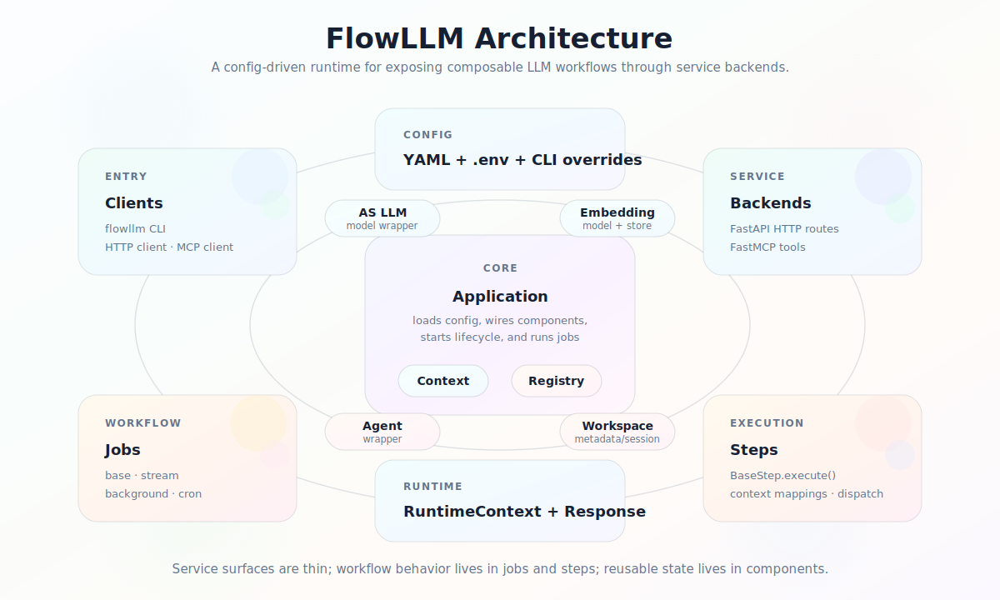

<p align="center">
  
</p>

<p align="center">
  <a href="https://pypi.org/project/flowllm/"></a>
  <a href="https://pypi.org/project/flowllm/"></a>
  <a href="https://pepy.tech/project/flowllm/"></a>
  <a href="https://github.com/flowllm-ai/flowllm"></a>
  <a href="./LICENSE"></a>
  <a href="./README.md"></a>
  <a href="./README_ZH.md"></a>
  <a href="https://github.com/flowllm-ai/flowllm"></a>
  <a href="https://deepwiki.com/flowllm-ai/flowllm"></a>
</p>

<p align="center">
  <strong>FlowLLM: Build LLM applications with ease.</strong><br>
</p>

FlowLLM is a configuration-driven LLM application framework that organizes workflows, service entrypoints, and
long-lived components with **Service, Job, Step, and Component**.

## ✨ Core Features

- **Configuration-driven**: Starts from `flowllm/config/default.yaml`, with config files and dot-notation overrides.
- **Unified path**: `CLI / Client -> Service -> Application -> Job -> Step -> Component`.
- **Flexible Jobs**: Supports sync, streaming, background, and scheduled tasks exposed through HTTP or MCP.
- **Pluggable components**: Extend Steps, Services, Clients, LLMs, Embeddings, Embedding Stores, and Agent Wrappers
  through registry `R`.

## 🆕 Minimal CLI Flow

FlowLLM also includes `flowllm.lite`, a tiny local CLI flow runner for scripts that do not need the full service
framework.
It maps `fl --action --field value` to a Pydantic config and a small ordered `BaseFlow`.
See [FlowLLM Lite](flowllm/lite/README.md) for the full minimal CLI flow design.

<p align="center">
  
</p>

## 🚀 Quick Start

### Installation

FlowLLM requires Python 3.11+.

Install development dependencies from source:

```bash
git clone https://github.com/flowllm-ai/flowllm.git
cd flowllm
pip install -e ".[dev]"
```

Install the optional Claude Code wrapper when needed:

```bash
pip install -e ".[claude-code]"
```

Install all optional dependencies:

```bash
pip install -e ".[full]"
```

### Start the Service

```bash
flowllm start
```

The default service address is `127.0.0.1:2333`, and the default workspace is `.flowllm/`. Startup automatically
creates:

```text
.flowllm/
├── metadata/
└── session/
```

You can override configuration from the command line:

```bash
flowllm start service.port=8181 enable_logo=false
flowllm start workspace_dir=/tmp/flowllm-demo service.host=127.0.0.1 service.port=8181
```

See the [Quick Start](docs/en/quick_start.md) for more startup and invocation examples.

## 🧩 Calling Jobs

After the service starts, CLI commands other than `start` call server-side Jobs with the same name through the client:

```bash
flowllm version
flowllm health_check
flowllm help
flowllm demo query="Hello FlowLLM" min_score=0.8
flowllm add a=1 b=2
```

The HTTP entry point is `POST /<job_name>`:

```bash
curl -s http://127.0.0.1:2333/add \
  -H 'Content-Type: application/json' \
  -d '{"a":1,"b":2}'
```

Streaming Jobs return SSE:

```bash
flowllm stream_demo query="Hi" repeat=3 interval=0.05

curl -N http://127.0.0.1:2333/stream_demo \
  -H 'Content-Type: application/json' \
  -d '{"query":"Hi","repeat":3,"interval":0.05}'
```

Built-in Jobs:

| Job            | Backend  | Description                                    |
|----------------|----------|------------------------------------------------|
| `version`      | `base`   | Returns the FlowLLM package version.           |
| `health_check` | `base`   | Returns a component health-check summary.      |
| `help`         | `base`   | Lists registered Jobs and their metadata.      |
| `demo`         | `base`   | Two-step echo example.                         |
| `add`          | `base`   | Adds two numbers.                              |
| `stream_demo`  | `stream` | Streams the input text character by character. |

## ⚙️ Configuration

The default configuration is located at `flowllm/config/default.yaml`. Root configuration sections include application
parameters, service, Jobs, and Components:

```yaml
service:
  backend: http

jobs:
  add:
    backend: base
    description: "add two numbers"
    steps:
      - backend: add_step
```

You can override model and embedding variables through `.env`:

```bash
cat > .env <<'EOF'
LLM_BACKEND=openai
LLM_MODEL_NAME=qwen3.7-plus
LLM_API_KEY=your_api_key
LLM_BASE_URL=https://dashscope.aliyuncs.com/compatible-mode/v1

EMBEDDING_BACKEND=openai
EMBEDDING_MODEL_NAME=text-embedding-v4
EMBEDDING_API_KEY=your_api_key
EMBEDDING_BASE_URL=https://dashscope.aliyuncs.com/compatible-mode/v1
EOF
```

You can also specify a YAML or JSON configuration file:

```bash
flowllm start config=/path/to/app.yaml
```

Configuration parsing supports `${VAR}`, `${VAR:-default}`, booleans, numbers, JSON lists and dictionaries, and
automatic `null` conversion.

## 🏗️ Code Framework

FlowLLM's core layering is:

```text
CLI / Client -> Service -> Application -> Job -> Step -> Component
```

| Layer         | Role                                                                                                                            |
|---------------|---------------------------------------------------------------------------------------------------------------------------------|
| `Application` | Loads configuration, creates the workspace, assembles Service, Components, and Jobs, and starts lifecycles in dependency order. |
| `Service`     | Exposes servable Jobs as HTTP routes or MCP tools.                                                                              |
| `Job`         | Orchestrates externally callable capabilities or background processes by executing Steps in order.                              |
| `Step`        | Atomic workflow operation that reads and writes `RuntimeContext`, `Response`, and streaming queues.                             |
| `Component`   | Long-lived infrastructure such as LLMs, Embeddings, Embedding Stores, and Agent Wrappers.                                       |
| `Registry`    | Global registry `R`, which looks up implementations by `(component_type, backend_name)`.                                        |

Minimal example for adding a Step:

```python
from flowllm.components import R
from flowllm.steps import BaseStep


@R.register("reverse_step")
class ReverseStep(BaseStep):
    async def execute(self):
        text = self.context.get("text", "")
        self.context.response.answer = text[::-1]
        return self.context.response
```

Then declare the Job in configuration:

```yaml
jobs:
  reverse:
    backend: base
    description: "reverse text"
    parameters:
      type: object
      properties:
        text:
          type: string
      required:
        - text
    steps:
      - backend: reverse_step
```

After adding an implementation, make sure the module is imported in the package `__init__.py`; otherwise, the
registration decorator will not run. See the [code framework](docs/en/framework.md) for details.

## 🔌 MCP Service

When the service backend is set to `mcp`, FlowLLM exposes non-streaming Jobs with `enable_serve: true` as MCP tools.
`StreamJob` is not exposed by MCP Service.

```yaml
service:
  backend: mcp
  transport: sse
  host: 127.0.0.1
  port: 2333
```

MCP transport supports `stdio`, `sse`, and `streamable-http`.

## 📚 Documentation

- [Quick Start](docs/en/quick_start.md)
- [Code Framework](docs/en/framework.md)
- [Contributing](docs/en/contributing.md)
- [FlowLLM Development Skill](skills/flowllm_dev/SKILL.md)

## 🤝 Open Source and Contributing

FlowLLM is licensed under Apache 2.0. Before contributing, read the [contribution guide](docs/en/contributing.md)
and [development skill](skills/flowllm_dev/SKILL.md), then run:

```bash
pre-commit run --all-files
pytest
```

## 📄 License

This project is open source under the Apache License 2.0. See [LICENSE](./LICENSE) for details.

## ⭐ Star History

[](https://www.star-history.com/#flowllm-ai/flowllm&Date)
