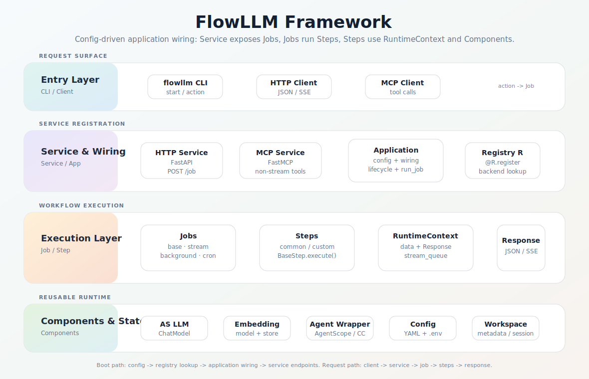

# FlowLLM 代码框架

FlowLLM 的运行链路：

```text
CLI / Client -> Service -> Application -> Job -> Step -> Component
```

`Application` 从配置装配服务、组件和 Job；`Service` 暴露可服务的 Job；`Job` 顺序执行 Step；`Step` 通过 `RuntimeContext`
共享请求数据、响应和流式队列。

<p align="center">
  
</p>

## 目录

```text
flowllm/
  application.py              # CLI 入口、Application 生命周期
  config/default.yaml         # 默认 service / jobs / components
  config/config_parser.py     # config=、dot notation、环境变量展开
  components/
    base_component.py         # BaseComponent、bind 依赖声明
    component_registry.py     # 全局注册表 R
    runtime_context.py        # 单次 Job 执行上下文
    job/                      # base / stream / background / cron
    service/                  # http / mcp
    client/                   # http / mcp
    as_llm/ as_embedding/     # 模型封装
    embedding_store/
    agent_wrapper/
  steps/
    base_step.py              # BaseStep、Ref、dispatch_steps
    common/                   # version、help、health_check、demo、add、stream_demo
  schema/                     # Request、Response、StreamChunk、配置模型
  enumeration/                # ComponentEnum、ChunkEnum
```

默认 workspace：

```text
.flowllm/
├── metadata/
└── session/
```

## 启动

`flowllm/application.py::main()` 处理三类命令：

| action         | 行为                                        |
|----------------|-------------------------------------------|
| `start`        | 加载 `.env` 和配置，创建 `Application`，启动 Service |
| `find_flowllm` | 查找项目路径                                    |
| 其他 action      | 通过 client 调用同名服务端 Job                     |

配置解析支持：

- 默认加载 `flowllm/config/default.yaml`。
- `config=/path/to/app.yaml` 指定 YAML/JSON。
- `service.port=8181` 这类 dot notation 覆盖配置。
- `${VAR}` 和 `${VAR:-default}` 环境变量展开。
- bool、数字、JSON list/dict、null 自动转换。

## Service

HTTP service 把 Job 注册为接口：

| Job 类型                | HTTP 行为                                   |
|-----------------------|-------------------------------------------|
| `BaseJob`             | `POST /<job.name>`，返回 `Response` JSON     |
| `StreamJob`           | `POST /<job.name>`，返回 `text/event-stream` |
| `enable_serve: false` | 不注册                                       |

MCP service 只暴露非流式、可服务的 Job。后台和定时任务默认不暴露。

## Registry

FlowLLM 使用全局注册表 `R`：

```python
from flowllm.components import R
from flowllm.steps import BaseStep


@R.register("reverse_step")
class ReverseStep(BaseStep):
    async def execute(self):
        text = self.context.get("text", "")
        self.context.response.answer = text[::-1]
        return self.context.response
```

注册 key 是 `(component_type, backend_name)`。同名 backend 可以存在于不同类型下，例如 `http` 同时是 service backend 和
client backend。

注册在模块 import 时发生。新增 Step 或 Component 后，要确保所在包的 `__init__.py` import 了新模块，否则配置里的 `backend`
找不到实现。

## Component

长期存在的基础设施继承 `BaseComponent`。常用生命周期：

- `start()`：解析依赖并调用 `_start()`。
- `close()`：调用 `_close()` 并反序关闭自有组件。
- `restart()`：关闭后重启。

组件依赖用 `BaseComponent.bind()` 声明，`Application` 会按依赖拓扑顺序启动：

```python
self.embedding_store = self.bind("default", BaseEmbeddingStore, optional=False)
```

## Job

Job 是外部可调用能力或后台流程的编排单元，配置在 `jobs:` 下。

- `BaseJob`：每次调用创建 `RuntimeContext`，顺序执行 Step，返回 `context.response`。
- `StreamJob`：Step 向 `stream_queue` 写 `StreamChunk`，服务层输出 SSE。
- `BackgroundJob`：按 `interval` 循环执行。
- `CronJob`：按 cron 表达式定时执行。

Job 配置示例：

```yaml
jobs:
  reverse:
    backend: base
    description: "reverse text"
    steps:
      - backend: reverse_step
```

## Step

Step 是工作流原子操作。它读写 `RuntimeContext`：

| 字段             | 说明           |
|----------------|--------------|
| `data`         | 请求参数和步骤间共享数据 |
| `response`     | 最终返回值        |
| `stream_queue` | 流式输出队列       |

流式输出：

```python
await self.context.add_stream_string(text, ChunkEnum.CONTENT)
```

Step 配置还支持 `input_mapping`、`output_mapping`、`prompt_dict`、`dispatch_steps` 和 `language`。访问应用组件时使用
`BaseStep.Ref`；默认已提供 `as_llm` 和可选的 `agent_wrapper`。

## 默认能力

`flowllm/config/default.yaml` 内置：

- `version`、`health_check`、`help`
- `demo`、`add`
- `stream_demo`
- 默认 `as_llm`、`as_embedding`、`embedding_store`、`agent_wrapper`
