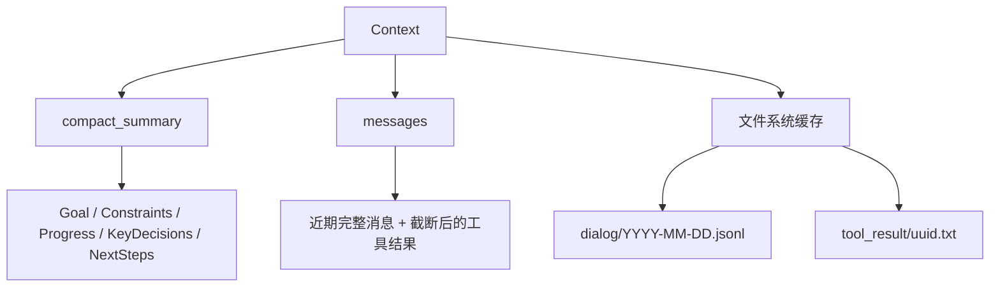
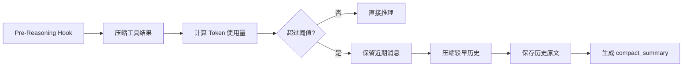
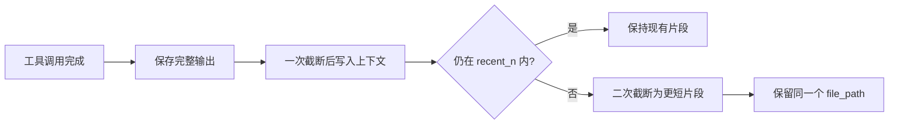
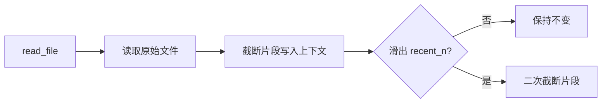
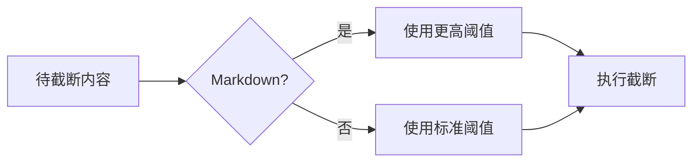

# 上下文管理设计

> 本文聚焦 Agent 的**短期上下文管理**：如何在有限上下文窗口内保存当前任务所需信息，并把暂时不需要但可能回溯的内容转移到文件系统。长期记忆只作为边界能力简要说明。

---

## 1. 问题背景

AI Agent 的上下文窗口是有限资源。随着任务推进，以下内容会持续挤占 Token 配额：

- 工具调用返回的大段 HTML、日志、搜索结果或文件内容；
- 多轮对话中不断累积的历史消息；
- 已经完成但仍保留在上下文里的中间过程；
- 结构化规则、技能说明、任务约束等高价值文本。

如果不主动管理，上下文会出现三个问题：

1. **窗口被撑满**：模型无法继续接收新的任务信息。
2. **关键信息被动丢失**：早期约束、决策和目标被简单截断。
3. **近期推理质量下降**：大量低价值历史内容占据窗口，模型难以关注当前步骤。

上下文管理的核心目标不是“保存所有内容到内存”，而是把不同价值、不同访问频率的信息放到合适的位置。

---

## 2. 设计目标

一个可用的上下文管理方案需要满足四个目标：

1. **近期消息完整可用**

   当前正在执行的任务、最近的用户指令、最近的工具结果应尽量保留在上下文中，保证 Agent 能连续推理。

2. **历史信息可压缩**

   较早的对话不应永久占用完整 Token，而应被压缩成结构化摘要，保留目标、约束、进展、关键决策和下一步。

3. **原始内容可回溯**

   被压缩或截断的原始内容不能直接丢失，应落盘保存，并在上下文中保留可续读的路径和行号提示。

4. **工具结果可控增长**

   工具输出是上下文膨胀的主要来源，必须在写入上下文时就做截断，而不是等窗口超限后再补救。

---

## 3. 总体结构

上下文分为两层：**内存层**和**文件系统层**。



### 3.1 内存层

内存层是模型每轮推理直接消费的内容，主要包含：

- **`messages`**：当前对话消息列表。近期消息尽量完整保留，历史工具结果可能只保留截断片段。
- **`compact_summary`**：历史对话压缩后的结构化摘要。它不是普通闲聊摘要，而是面向继续执行任务的工作状态。

`compact_summary` 建议包含以下字段：

| 字段             | 作用                       |
|----------------|--------------------------|
| `Goal`         | 当前任务目标                   |
| `Constraints`  | 用户要求、系统限制、不能破坏的约束        |
| `Progress`     | 已完成的工作和当前状态              |
| `KeyDecisions` | 已经确定的方案、取舍和原因            |
| `NextSteps`    | 后续应执行的步骤                 |
| `DialogPath`   | 原始历史对话文件路径，以及建议从后往前读取的提示 |

### 3.2 文件系统层

文件系统层保存不适合长期驻留内存的大内容：

- **历史对话原文**：保存到 `dialog/YYYY-MM-DD.jsonl`，用于回溯被压缩前的完整消息。
- **工具调用原文**：保存到 `tool_result/{uuid}.txt`，用于回溯被截断前的完整输出。

这层的作用是把上下文窗口从“存储介质”变成“索引和工作区”：内存保存当前需要的信息，文件系统保存之后可能需要的信息。

---

## 4. 推理前生命周期

每轮推理开始前执行一次上下文整理流程，确保进入模型前的上下文处于可控状态。



流程分为四步：

1. **压缩工具结果**

   先处理消息列表中的工具输出。超长工具结果只在上下文中保留片段，完整内容保存到文件系统。

2. **检查上下文大小**

   计算当前上下文 Token 使用量，判断是否超过压缩阈值。

3. **压缩历史对话**

   如果超过阈值，则保留最近一段消息，较早消息交给压缩器生成 `compact_summary`。

4. **持久化原始历史**

   被压缩的原始消息写入 `dialog/YYYY-MM-DD.jsonl`，并把路径写回摘要，方便后续按需读取。

---

## 5. 工具结果的两阶段截断

工具结果需要单独处理，因为它们通常体积大、密度低、增长快。

设计上采用**两阶段截断**：

| 阶段   | 触发时机       | 目标                  |
|------|------------|---------------------|
| 一次截断 | 工具结果写入上下文时 | 防止单次工具输出直接撑爆上下文     |
| 二次截断 | 推理前整理历史消息时 | 随着消息变旧，进一步降低它的上下文占用 |



### 5.1 一次截断

一次截断发生在工具结果刚写入上下文时。

处理逻辑：

1. 判断输出是否超过 `max_bytes`。
2. 未超过则直接写入上下文。
3. 超过则把完整内容写入 `tool_result/{uuid}.txt`。
4. 上下文中只保留前半段片段，并追加续读提示。

续读提示应包含：

- 原始内容保存路径；
- 原始内容总行数；
- 当前片段起始行；
- 下一次读取建议使用的 `start_line`。

示例：

```text
<<<TRUNCATED>>>
The full content is saved to tool_result/abc123.txt.
This excerpt starts at line 1.
Read from start_line=751 to continue.
```

一次截断的关键点是：**工具结果一进入上下文就必须受控**。

### 5.2 二次截断

二次截断发生在推理前整理阶段，只处理已经滑出近期窗口的历史工具消息。

处理逻辑：

1. 识别消息是否已经包含截断标记。
2. 分离原始片段和截断通知。
3. 按更小的 `max_bytes` 重新截断片段。
4. 更新续读提示中的覆盖字节数和下一行号。
5. 保持 `file_path` 不变。

二次截断的关键点是：**截断只改变上下文中的片段，不改变原始文件路径**。无论消息被压缩多少次，Agent 都能通过同一个路径找回完整内容。

---

## 6. ReadFile 的特殊处理

`read_file` 和普通工具输出使用同一套截断机制，但它有一个区别：读取的原始文件本身已经存在。

因此，`read_file` 的一次截断不需要再把完整内容复制到 `tool_result/`，只需要在上下文提示中保留原始文件路径和续读位置。

| 阶段     | 行为                       |
|--------|--------------------------|
| 一次截断   | 读取文件时截断，消息中记录原始文件路径和下一行号 |
| 近期窗口内  | 保持读取时的截断结果               |
| 滑出近期窗口 | 执行二次截断，进一步缩短上下文片段        |



---

## 7. Markdown 文件保护策略

Markdown 文件通常承载结构化知识、规则或技能说明。它们和普通工具日志不同，过度截断可能破坏语义结构。

因此，对 Markdown 文件应使用更宽松的截断阈值：

- 一次截断时允许保留更大的片段；
- 二次截断时也使用高于普通工具输出的阈值；
- 优先保留标题、列表、代码块边界等结构完整性。



这条策略的本质是：不同类型的信息价值密度不同，截断策略也应不同。

---

## 8. 历史压缩与长期记忆的边界

短期上下文压缩和长期记忆不是同一件事。

| 能力      | 目标        | 输出                         |
|---------|-----------|----------------------------|
| 短期上下文压缩 | 让当前任务继续执行 | `compact_summary` + 原始对话路径 |
| 长期记忆    | 跨会话保留稳定信息 | `Memory.md`、日记或用户画像        |

短期压缩关注的是“当前任务下一步怎么继续”，例如：

- 任务目标；
- 已经改过哪些文件；
- 用户明确提出的约束；
- 当前阻塞点；
- 下一步操作。

长期记忆关注的是“未来任务是否还会用到”，例如：

- 用户长期偏好；
- 项目固定约定；
- 反复出现的失败经验；
- 稳定的工作流程。

上下文压缩可以把一部分高价值信息交给长期记忆模块，但这应是独立流程，不能让长期记忆逻辑干扰每轮短期上下文整理。

---

## 9. 关键不变量

实现时需要保证以下不变量：

1. **原始内容不能因为截断而丢失**

   只要上下文中出现截断提示，就必须存在可访问的原始文件路径。

2. **续读提示必须可执行**

   提示中的 `file_path`、`start_line`、总行数等信息应能直接指导 Agent 继续读取。

3. **近期消息优先级最高**

   最近用户指令、最近工具结果、当前任务状态应优先保留。

4. **摘要必须面向行动**

   `compact_summary` 不是文学摘要，应服务于下一轮推理和任务恢复。

5. **二次截断不能破坏文件引用**

   历史消息可以越来越短，但 `file_path` 必须稳定指向完整原文。

---

## 10. 小结

上下文管理的核心设计可以概括为一句话：

**内存只保存当前推理需要的内容，文件系统保存之后可能回溯的内容。**

具体落地时，系统通过三类机制协同工作：

- 用 `messages` 保留近期上下文；
- 用 `compact_summary` 承接较早历史；
- 用 `dialog/` 和 `tool_result/` 保存完整原文。

这样即使对话持续很长，Agent 也不需要把全部历史塞进上下文窗口；它只需要保留当前工作集，并在必要时通过文件路径回溯完整信息。
